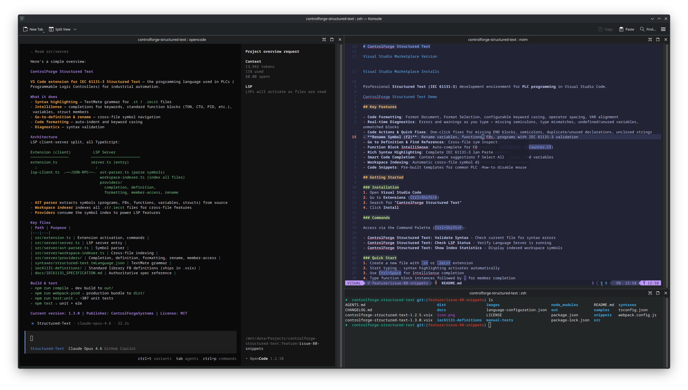

# Actively Used

Links can be repos or websites.

## Using for development

- [Git](https://github.com/git/git) — Core VCS for source control.
- [GitHub CLI](https://github.com/cli/cli) — CLI for issues, PRs, and releases.
- [VS Code](https://github.com/microsoft/vscode) — Daily IDE, shifting to Neovim.
- [Neovim](https://github.com/neovim/neovim) — TUI editor for fast edits.
- [nvim-lspconfig](https://github.com/neovim/nvim-lspconfig) — LSP config for Neovim.
- [TypeScript](https://github.com/microsoft/TypeScript) — Language tooling for TS builds.
- [Node.js](https://github.com/nodejs/node) — JS runtime for legacy workloads, migrating away.
- [Deno](https://github.com/denoland/deno) — TS runtime as the new default.
- [Vite](https://github.com/vitejs/vite) — Frontend build tool.
- [Jest](https://github.com/jestjs/jest) — JS test runner, used less as Deno focus grows.
- [ESLint](https://github.com/eslint/eslint) — Linting for JS/TS code quality.
- [Prettier](https://github.com/prettier/prettier) — Formatting for consistent style.
- [SvelteKit](https://github.com/sveltejs/kit) — App framework for Svelte.
- [Svelte](https://github.com/sveltejs/svelte) — UI framework.
- [NestJS](https://github.com/nestjs/nest) — Backend framework for TS APIs.
- [RxJS](https://github.com/ReactiveX/rxjs) — Reactive streams library.
- [Axios](https://github.com/axios/axios) — HTTP client.
- [Date-fns](https://github.com/date-fns/date-fns) — Date utilities.
- [Sharp](https://github.com/lovell/sharp) — Image processing pipeline.
- [Phaser](https://github.com/phaserjs/phaser) — Game engine for 2D projects.
- [Ethers](https://github.com/ethers-io/ethers.js) — Ethereum library for web3.
- [LLVM/Clang](https://github.com/llvm/llvm-project) — Clang toolchain.
- [GCC](https://github.com/gcc-mirror/gcc) — C/C++ toolchain.
- [Ollama](https://github.com/ollama/ollama) — Local LLM runtime.

## Rig/setup

- [Fedora](https://getfedora.org/) — Current OS base.
- [KDE Plasma](https://github.com/KDE/plasma-desktop) — Desktop environment for my current setup.
- [Moby](https://github.com/moby/moby) — Container runtime engine.
- [tmux](https://github.com/tmux/tmux) — Terminal multiplexer for long sessions.
- [Zsh](https://github.com/zsh-users/zsh) — Shell.
- [Oh My Zsh](https://github.com/ohmyzsh/ohmyzsh) — Zsh config framework.
- [Powerlevel10k](https://github.com/romkatv/powerlevel10k) — Prompt theme.
- [btop](https://github.com/aristocratos/btop) — System monitor.

## AI setup

- [OpenCode](https://github.com/anomalyco/opencode) — CLI coding agent for daily AI workflows.
- [GitHub Copilot](https://github.com/github/copilot-docs) — Copilot subscription and docs.

## Things I built

- [ControlForge Structured Text](https://github.com/ControlForge-Systems/controlforge-structured-text) — VS Code extension for IEC 61131-3.
- [Ordis](https://github.com/ordis-dev/ordis) — Schema-first extraction tool.
- [ControlForge Website](https://github.com/ControlForge-Systems/controlforge-website) — Marketing site for ControlForge.
- [Michael Distel Website](https://github.com/michaeldistel/michael-distel-website) — Personal site and notes.
- [Kicking Miles Website](https://github.com/michaeldistel/kicking-miles-website) — Travel site.

## Archive

- [Angular](https://github.com/angular/angular) — UI framework, heavy past usage, not current.
- [Firebase](https://github.com/firebase/firebase-js-sdk) — Client SDK for auth and DB, heavy past usage, not current.
- [Firebase Admin](https://github.com/firebase/firebase-admin-node) — Server SDK for Firebase, heavy past usage, not current.
- [Firebase Functions](https://github.com/firebase/firebase-functions) — Cloud Functions SDK, heavy past usage, not current.
